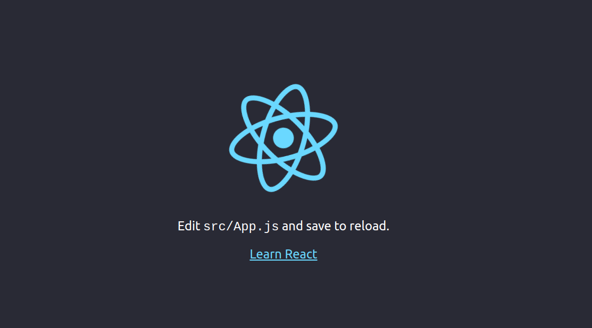

# skeleton-react-maven

How this works???

You need run : mvn clean 

After : mvn build

Finish: java -jar ${base_dir}/target/skeleton-oi.jar or if you open this project at Eclipse or other IDE, run as Java App.

Acess: http://localhost:8080, if the react proxy works rsrs, you can see that page:

Enjoy, and let's code!

If you identified something wrong, please help me, i'm a noob :)

